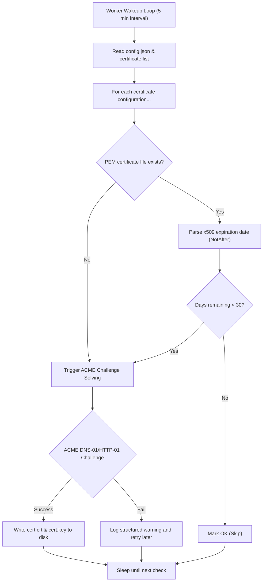

Certer runs as a single-binary daemon that hosts two primary sub-systems concurrently:
1.  **REST API Service**: Listens for certificate configurations, key creations, and retrieval requests.
2.  **Scheduler Daemon (Worker Loop)**: Periodically reviews certificates in the configuration to check if they need issuance, verification, or renewal.

---

## The Background Worker Loop

The background scheduler checks all configured certificates every **5 minutes** (or when the file configurations change). Here is how a certificate transitions from creation to active renewal:

---

## Core Characteristics

### 1. File-Based Storage
Certer stores all issued certificates and keys in the `/app/certs/` mount as PEM files:
*   `{certificate_uuid}.crt`: Contains the full certificate chain (end-entity cert + intermediate CAs).
*   `{certificate_uuid}.key`: Contains the PEM-encoded private key.

### 2. Lock-free Concurrency
To ensure safety and avoid race conditions or Let's Encrypt rate-limit blocks:
*   Only **one** worker loop processes the scheduler task at any given time.
*   We run the daemon with a replica count of `1` (single container instance).
*   In-memory state and the configuration file (`config.json`) are updated atomically.

### 3. Solvers
Currently, Certer leverages the `lego` library to solve:
*   **DNS-01**: Performs ACME validation by publishing temporary TXT records. (Cloudflare is natively supported).
*   **HTTP-01**: Solves challenge requests via standard web routing.
