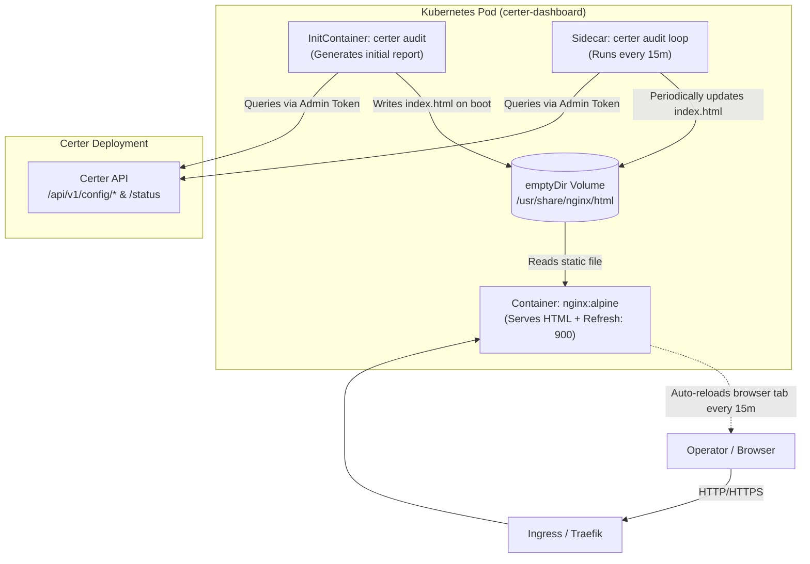

This guide demonstrates how to deploy a self-refreshing, production-ready **Certer Audit Dashboard** in Kubernetes. 

By pairing the `certer audit` CLI with a lightweight Nginx web server using the Kubernetes **Sidecar pattern**, you can serve an always-up-to-date HTML inventory of teams, certificate configurations, API keys, and certificate health without modifying the core Certer daemon.

---

## Architecture Overview



### Key Highlights
* **Zero Core Modifications**: Utilizes the built-in `certer audit --format html` command.
* **Instant Startup**: The `initContainer` builds the initial HTML report before the Pod marks itself `Ready`, preventing blank pages or 404s.
* **Automatic Browser Reloading**: Nginx injects a `Refresh: 900` HTTP header, prompting any open browser tab to reload every 15 minutes seamlessly.
* **No Persistent Storage**: Uses a simple in-memory/ephemeral `emptyDir` volume.

---

## Prerequisites

1. A running **Certer** instance in your cluster (e.g., `http://certer.default.svc.cluster.local:8080`).
2. An **Admin API Token** for Certer (audit endpoints query `/api/v1/config/*` which require admin privileges).
3. `kubectl` configured with cluster access.

---

## Step 1: Generate an Admin API Key

The audit report collects configurations from `/api/v1/config/teams`, `/api/v1/config/certificates`, `/api/v1/config/api_keys`, and `/api/v1/certificates/status`. This requires an API key with `"admin": true`.

### Option A: Using the `certer keygen` CLI
```bash
certer keygen
```
Output:
```text
Generated plain-text token: 3b94a159981881e14948a31ec1ecb552
Argon2id Hash (paste into config.json):
$argon2id$v=19$m=65536,t=3,p=2$5e3EMry5...
```
Add the generated hash to Certer's `config.json` under `api_keys`:
```json
{
  "description": "Dashboard Audit Token",
  "token": "$argon2id$v=19$m=65536,t=3,p=2$5e3EMry5...",
  "admin": true
}
```

### Option B: Using the Control Plane API
If Certer is already running with an initial admin token:
```bash
curl -X POST http://certer.local:8080/api/v1/config/api_keys \
  -H "Authorization: Bearer <EXISTING_ADMIN_TOKEN>" \
  -H "Content-Type: application/json" \
  -d '{
    "description": "Dashboard Audit Token",
    "allowed_certificates": [],
    "allowed_teams": [],
    "admin": true
  }'
```
Keep the returned `cleartext_token` ready for Step 2.

---

## Step 2: Create the Kubernetes Manifests

Create a unified deployment file named `certer-dashboard.yaml`:

```yaml
---
apiVersion: v1
kind: Secret
metadata:
  name: certer-dashboard-secret
  namespace: default
type: Opaque
stringData:
  # Replace with your plain-text admin token
  AUDIT_TOKEN: "3b94a159981881e14948a31ec1ecb552"

---
apiVersion: v1
kind: ConfigMap
metadata:
  name: certer-dashboard-nginx-conf
  namespace: default
data:
  default.conf: |
    server {
        listen 80;
        server_name _;

        root /usr/share/nginx/html;
        index index.html;

        location / {
            try_files $uri $uri/ /index.html;

            # Instruct browsers to reload every 15 minutes (900s)
            add_header Refresh "900";

            # Disable browser caching so updates render immediately
            add_header Cache-Control "no-cache, no-store, must-revalidate";
            add_header Pragma "no-cache";
            add_header Expires "0";
        }

        # Health endpoint for Kubernetes liveness/readiness probes
        location /healthz {
            return 200 "OK\n";
            add_header Content-Type text/plain;
        }
    }

---
apiVersion: apps/v1
kind: Deployment
metadata:
  name: certer-dashboard
  namespace: default
  labels:
    app: certer-dashboard
spec:
  replicas: 1
  selector:
    matchLabels:
      app: certer-dashboard
  template:
    metadata:
      labels:
        app: certer-dashboard
    spec:
      volumes:
        - name: html-storage
          emptyDir: {}
        - name: nginx-config
          configMap:
            name: certer-dashboard-nginx-conf

      # 1. INIT CONTAINER: Run audit once before web server starts
      initContainers:
        - name: initial-audit
          image: ghcr.io/your-org/certer:latest
          command: ["/bin/sh", "-c"]
          args:
            - |
              echo "Generating initial Certer HTML dashboard..."
              certer audit --format html --output /usr/share/nginx/html/index.html
          env:
            - name: AUDIT_URL
              value: "http://certer.default.svc.cluster.local:8080"
            - name: AUDIT_TOKEN
              valueFrom:
                secretKeyRef:
                  name: certer-dashboard-secret
                  key: AUDIT_TOKEN
          volumeMounts:
            - name: html-storage
              mountPath: /usr/share/nginx/html

      containers:
        # 2. WEB SERVER CONTAINER: Serves the static HTML report
        - name: web-server
          image: nginx:alpine
          ports:
            - containerPort: 80
              name: http
          livenessProbe:
            httpGet:
              path: /healthz
              port: 80
            initialDelaySeconds: 5
            periodSeconds: 10
          readinessProbe:
            httpGet:
              path: /healthz
              port: 80
            initialDelaySeconds: 2
            periodSeconds: 5
          resources:
            requests:
              cpu: 10m
              memory: 16Mi
            limits:
              cpu: 50m
              memory: 32Mi
          volumeMounts:
            - name: html-storage
              mountPath: /usr/share/nginx/html
              readOnly: true
            - name: nginx-config
              mountPath: /etc/nginx/conf.d/default.conf
              subPath: default.conf
              readOnly: true

        # 3. SIDECAR CONTAINER: Refreshes the HTML report every 15 minutes
        - name: audit-refresher
          image: ghcr.io/your-org/certer:latest
          command: ["/bin/sh", "-c"]
          args:
            - |
              while true; do
                sleep 900
                echo "[$(date -u +'%Y-%m-%dT%H:%M:%SZ')] Refreshing Certer report..."
                certer audit --format html --output /usr/share/nginx/html/index.html || echo "Warning: failed to update report"
              done
          env:
            - name: AUDIT_URL
              value: "http://certer.default.svc.cluster.local:8080"
            - name: AUDIT_TOKEN
              valueFrom:
                secretKeyRef:
                  name: certer-dashboard-secret
                  key: AUDIT_TOKEN
          resources:
            requests:
              cpu: 10m
              memory: 32Mi
            limits:
              cpu: 100m
              memory: 64Mi
          volumeMounts:
            - name: html-storage
              mountPath: /usr/share/nginx/html

---
apiVersion: v1
kind: Service
metadata:
  name: certer-dashboard
  namespace: default
  labels:
    app: certer-dashboard
spec:
  type: ClusterIP
  ports:
    - port: 80
      targetPort: 80
      name: http
  selector:
    app: certer-dashboard
```

---

## Step 3: Expose via Ingress (Optional)

To expose the dashboard to your team over HTTPS, apply an Ingress resource (example for Traefik / cert-manager):

```yaml
apiVersion: networking.k8s.io/v1
kind: Ingress
metadata:
  name: certer-dashboard-ingress
  namespace: default
  annotations:
    cert-manager.io/cluster-issuer: "letsencrypt-prod"
spec:
  ingressClassName: traefik
  rules:
    - host: certer-dashboard.example.com
      http:
        paths:
          - path: /
            pathType: Prefix
            backend:
              service:
                name: certer-dashboard
                port:
                  number: 80
  tls:
    - hosts:
        - certer-dashboard.example.com
      secretName: certer-dashboard-tls
```

---

## Step 4: Deploy and Verify

1. Apply the manifests:
   ```bash
   kubectl apply -f certer-dashboard.yaml
   ```

2. Check Pod startup:
   ```bash
   kubectl get pods -l app=certer-dashboard
   ```
   *You should see the init container run and finish, followed by `2/2` containers in `Running` state.*

3. Forward port for local inspection:
   ```bash
   kubectl port-forward svc/certer-dashboard 8080:80
   ```

4. Open `http://localhost:8080` in your web browser:
   * The complete Certer dashboard is rendered with live certificate health, teams, and keys.
   * Check browser network devtools: the HTTP response headers will include `Refresh: 900`, triggering automatic page reloads every 15 minutes.
