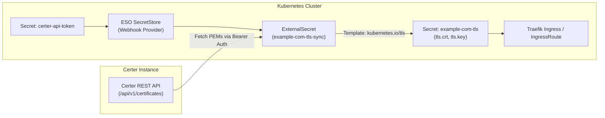

This guide walks through using **External Secrets Operator (ESO)** to continuously pull TLS certificates and private keys from **Certer** and inject them as standard `kubernetes.io/tls` Secrets. Traefik (or any Ingress controller) will automatically consume and hot-reload these certificates.

---

## Overview



### Why Use This Pattern?
* **Zero Custom Scripts**: Leverages ESO's native `Webhook` provider to fetch raw PEM certificates.
* **Automatic Renewal & Hot Reload**: When Certer renews a certificate before expiration, ESO detects changes within its refresh interval and updates the Secret. Traefik dynamically reloads the new certificate without restarting or dropping traffic.
* **Granular RBAC**: Use Certer's scoped API keys to limit which certificates a specific namespace or team can pull.

---

## Prerequisites

1. A running **Certer** instance accessible from the Kubernetes cluster (e.g. `http://certer.certer.svc.cluster.local:8080` or an external URL).
2. [External Secrets Operator (ESO)](https://external-secrets.io/) installed in your Kubernetes cluster.
3. [Traefik](https://traefik.io/) installed as your Ingress controller.
4. A certificate configured and issued in Certer for your domain (e.g., `example.com`).

---

## Step 1: Create a Scoped API Key in Certer

Create an API key in Certer that has access to the target certificate or team.

Using the Certer control plane API or Terraform provider:

```sh
curl -X POST http://certer.local:8080/api/v1/config/api_keys \
  -H "Authorization: Bearer <ADMIN_TOKEN>" \
  -H "Content-Type: application/json" \
  -d '{
    "description": "K8s ESO Sync Token - example.com",
    "allowed_certificates": ["019eebb8-74a1-70da-96fb-1d2d28db29b9"],
    "allowed_teams": [],
    "admin": false
  }'
```

Save the generated `cleartext_token` returned in the response.

---

## Step 2: Store the Certer Token in Kubernetes

Create a secret in the target namespace containing the cleartext API token:

```yaml
apiVersion: v1
kind: Secret
metadata:
  name: certer-api-token
  namespace: default
  labels:
    external-secrets.io/type: webhook
type: Opaque
stringData:
  token: "YOUR_CERTER_CLEARTEXT_TOKEN"
```

Apply the secret:

```sh
kubectl apply -f certer-token-secret.yaml
```

---

## Step 3: Configure ESO SecretStore (Webhook Provider)

Create an ESO `SecretStore` (or cluster-wide `ClusterSecretStore`) utilizing the **Webhook** provider. The `SecretStore` points to Certer's API base URL and dynamically injects the Bearer token from the secret created in Step 2:

```yaml
apiVersion: external-secrets.io/v1
kind: SecretStore
metadata:
  name: certer-backend
  namespace: default
spec:
  provider:
    webhook:
      url: "http://certer-internal.certer.svc.cluster.local:8080/api/v1/certificates/{{ .remoteRef.key }}/{{ .remoteRef.property }}"
      headers:
        Authorization: "Bearer {{ .token.token }}"
      secrets:
        - name: token
          secretRef:
            name: certer-api-token
            key: token
```

Apply the SecretStore:

```sh
kubectl apply -f certer-secretstore.yaml
```

---

## Step 4: Define the ExternalSecret

Create an `ExternalSecret` resource. Certer provides raw PEM endpoints (`/certificates/{identifier}/certificate` and `/certificates/{identifier}/private-key`) where `{identifier}` can be the domain name or certificate UUID.

The `ExternalSecret` specifies `remoteRef.key` (domain) and `remoteRef.property` (endpoint) which ESO interpolates into the `SecretStore` webhook URL:

```yaml
apiVersion: external-secrets.io/v1
kind: ExternalSecret
metadata:
  name: example-com-tls-sync
  namespace: default
spec:
  refreshInterval: 1h # Checks for renewed certificates hourly
  secretStoreRef:
    name: certer-backend
    kind: SecretStore
  target:
    name: example-com-tls # Name of the generated Kubernetes Secret
    creationPolicy: Owner
    template:
      type: kubernetes.io/tls
      data:
        tls.crt: "{{ .certificate }}"
        tls.key: "{{ .privateKey }}"
  data:
    - secretKey: certificate
      remoteRef:
        key: "example.com"
        property: "certificate"
    - secretKey: privateKey
      remoteRef:
        key: "example.com"
        property: "private-key"
```

Apply the ExternalSecret:

```sh
kubectl apply -f example-com-externalsecret.yaml
```

---

## Step 5: Verify Secret Generation

Check the status of the `ExternalSecret` and verify that the target TLS Secret has been created:

```sh
# Check ExternalSecret sync status
kubectl get externalsecret example-com-tls-sync -n default

# Inspect the generated Kubernetes TLS Secret
kubectl get secret example-com-tls -n default -o yaml
```

You should see a Secret with `type: kubernetes.io/tls` containing both `tls.crt` and `tls.key`.

---

## Step 6: Use in Traefik Ingress

You can now reference `example-com-tls` in your Traefik Ingress or `IngressRoute` resources.

### Option A: Standard Kubernetes Ingress

```yaml
apiVersion: networking.k8s.io/v1
kind: Ingress
metadata:
  name: web-app-ingress
  namespace: default
  annotations:
    traefik.ingress.kubernetes.io/router.entrypoints: websecure
spec:
  ingressClassName: traefik
  tls:
    - hosts:
        - example.com
      secretName: example-com-tls
  rules:
    - host: example.com
      http:
        paths:
          - path: /
            pathType: Prefix
            backend:
              service:
                name: web-app-service
                port:
                  number: 80
```

### Option B: Traefik IngressRoute (CRD)

```yaml
apiVersion: traefik.io/v1alpha1
kind: IngressRoute
metadata:
  name: web-app-ingressroute
  namespace: default
spec:
  entryPoints:
    - websecure
  routes:
    - match: Host(`example.com`)
      kind: Rule
      services:
        - name: web-app-service
          port: 80
  tls:
    secretName: example-com-tls
```

---

## Summary & Maintenance

* **Automatic Renewals**: When Certer executes background ACME renewals, the updated certificate is served by `/api/v1/certificates/{domain}/certificate`.
* **Synchronization**: On the next `refreshInterval` cycle, ESO updates the `example-com-tls` Secret.
* **Traefik Hot-Reload**: Traefik automatically detects the modified secret and replaces the active TLS certificate in memory with zero downtime.
